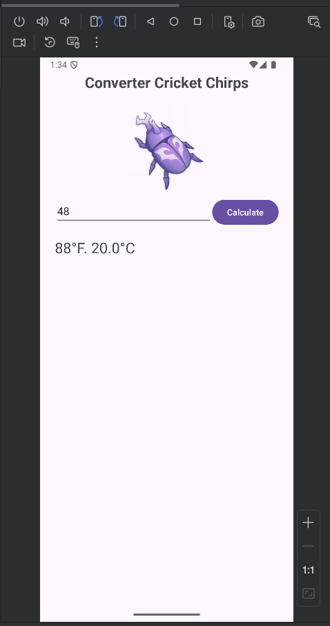

# Converter Cricket Chirps

> This is a school homework project. It is created for educational purposes only and is not intended for commercial use.

This app calculates the air temperature based on cricket chirps, using the method described in the article: [https://www.almanac.com/predict-temperature-cricket-chirps](https://www.almanac.com/predict-temperature-cricket-chirps)

## 📁 Main Files

- [MainActivity.java](app/src/main/java/com/example/domaci_rad_2/MainActivity.java)
- [activity_main.xml](app/src/main/res/layout/activity_main.xml)